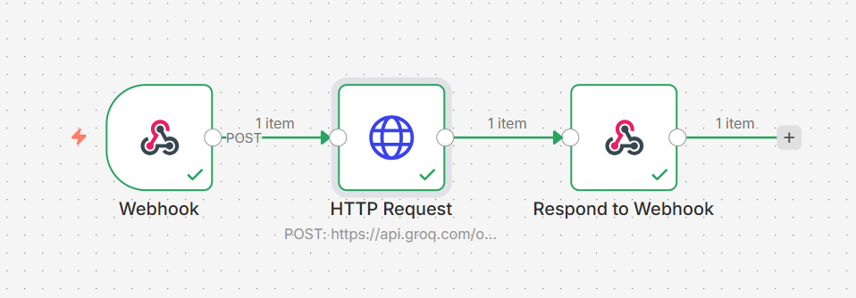

# Resume-Review-AI-Agent-n8n-Groq-

An AI-powered Resume Review Agent built using n8n and the Groq LLM API. This agent accepts a resume and job role via a webhook and returns structured, beginner-friendly feedback like an HR reviewer.

## 🚀 Features

Accepts input via n8n Webhook

Sends prompt to Groq LLM API

Returns AI-generated response instantly

No frontend required (can be tested using curl / Postman)

Beginner-friendly workflow

## 🛠️ Tech Stack

n8n – Workflow automation

Groq API – Large Language Model (LLM)

HTTP Request Node – API communication

Webhook Trigger – Entry point

## 🔄 Workflow Overview
Webhook → HTTP Request (Groq API) → Respond to Webhook

Node Explanation

Webhook
Receives incoming HTTP POST requests with user input.

HTTP Request
Sends the prompt to Groq API and fetches the AI response.

Respond to Webhook
Returns the AI output back to the caller.

## ⚙️ Setup Instructions
1️⃣ Create Workflow in n8n

Add Webhook node (Method: POST)

Add HTTP Request node

Add Respond to Webhook node

Connect nodes in order

## 2️⃣ Configure HTTP Request Node (Groq)

Method: POST
URL: https://api.groq.com/openai/v1/chat/completions

Headers: Authorization: Bearer YOUR_GROQ_API_KEY
Content-Type: application/json

Body (JSON): {
  "model": "llama3-8b-8192",
  "messages": [
    {
      "role": "user",
      "content": "{{ $json.body.prompt }}"
    }
  ]
}

3️⃣ Configure Respond to Webhook Node

Response Mode: Last Node

Response Body: JSON

🧪 Testing the Agent

## 🖼 Workflow Overview

## You can test the workflow using curl:

curl -X POST YOUR_WEBHOOK_URL \
-H "Content-Type: application/json" \
-d '{
  "prompt": "Explain AI in simple words"
}'

## 🌱 Future Improvements

Add input validation

Add memory/context support

Add frontend UI

Add multiple AI tools

## 👩‍💻 Author

Monali Nagardhankar
Tech Enthusiast | AI & Automation Learner
